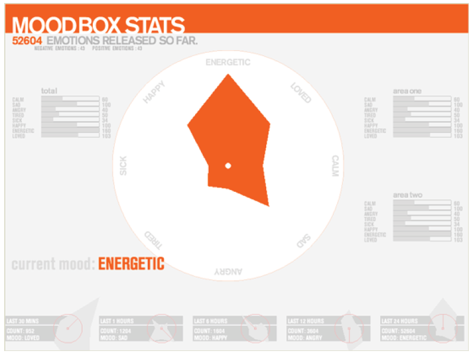

moodbox
=======
Moodbox / Year 2007
 
INTRO
MoodBox is a project attempting to reveal our common but not linguistically
shared feelings in our everyday life.
What if we can log our emotions over time? What if this log consists of not only
our individual data but a collective log of environment we participate in. In
what ways being aware of other people’s emotions affect us? Could this
collectivity create expressions we can perceive? (make us more happy, less tired
etc.) MoodBox is a project attempting to reveal our common but not linguistically
shared feelings in our everyday life.

In order to achieve this, I built two wirelessly connected device and installed
them in public spaces. I visualize the data I collect from these devices in
realtime. This software is the visualization software I built in Processing.

This software is built using Processing/Java. It takes the data from the
physical moodboxes and displays it in the software. This repo hosts the source
code, and applications compatible for OS X, Win32, Win64, Linux. 

The url for the video that shows the application in action is  [https://vimeo.com/119017517](https://vimeo.com/119017517)

The url for development process of physical devices and source codes are [http://wiki.klaweht.com/networkedobjects/projects/moodbox](http://wiki.klaweht.com/networkedobjects/projects/moodbox)

Enjoy!

